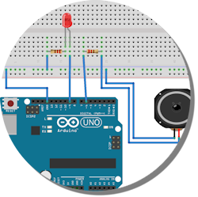

# FlickeringLights

FlickeringLights is a small library for Arduino, that simulates different lights and sounds for model railroads.

## Download

[Zip](https://github.com/fx-world/FlickeringLights/archive/master.zip)

## Examples

* [Welding Light](examples/SimpleWelderLight)
* [TV Light](examples/SimpleTVLight)

## License

Copyright (C) 2016 Pascal Weyprecht

This software may be modified and distributed under the terms
of the MIT license.  See the [LICENSE](LICENSE) file for details.