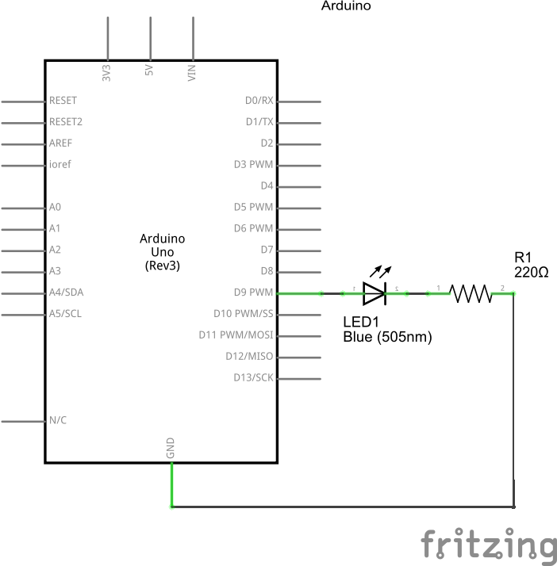
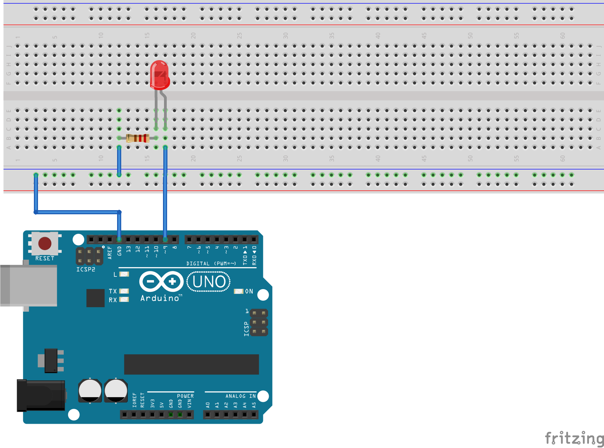

# SimpleTVLight Example

This demonstractes the use of one LED for simulating a TV.

## wiring plan



[Fritzing File](TVLight.fzz)

## source code

```C++
#include <TVLight.h>

// Declares a new TV light on pin 9
TVLight light = TVLight(9);

void setup() {
  light.setup();
}

void loop() {
  light.step();
  delayMicroseconds(100);
}

```
[Arduino IDE File](SimpleTVLight.ino)