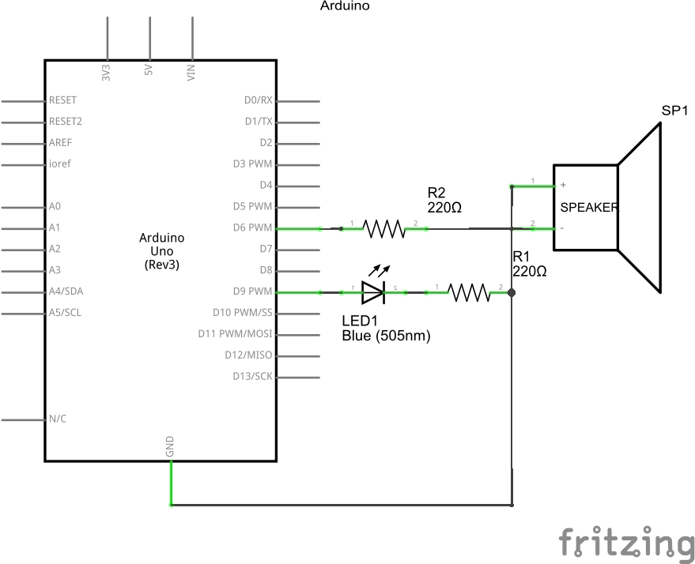
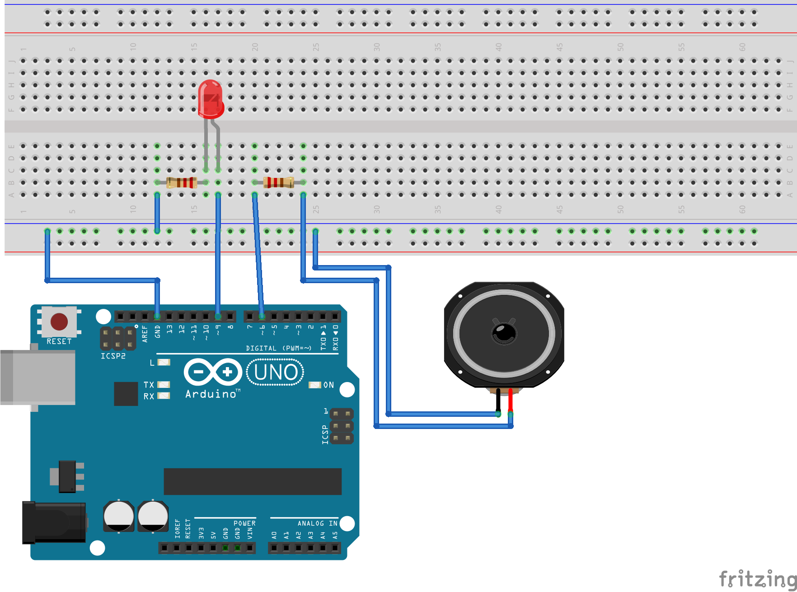

# SimpleWelderLight Example

This demonstractes the use of a LED and a PC-speaker for simulating a welder.

## wiring plan



[Fritzing File](WelderLight.fzz)

## source code

```C++
#include <WelderLight.h>

// Declares a new welding light on pin 9 and sound on pin 6
WelderLight light = WelderLight(9, 6);

void setup() {
  light.setup();
}

void loop() {
  light.step();
  delayMicroseconds(100);
}

```
[Arduino IDE File](SimpleWelderLight.ino)